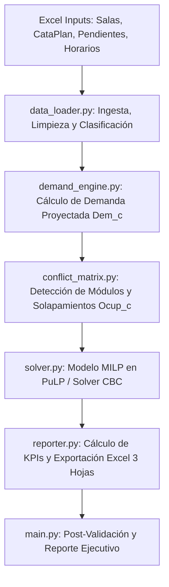

# DOCUMENTACIÓN TÉCNICA Y MATEMÁTICA
## Sistema de Optimización de Asignación de Salas Universitarias (MILP)
**Carrera:** Ingeniería Civil Electrónica (ICE110) — Universidad Mayor  
**Motor de Optimización:** Mixed-Integer Linear Programming (MILP) con PuLP / COIN-OR CBC  
**Marco Normativo y Conceptual:** *Decreto N° 01 de 2026* y *Modelo de Optimización del Uso de Salas*

---

## 1. INTRODUCCIÓN Y OBJETIVO DEL ALGORITMO

El problema central que resuelve este sistema es la **subutilización y mala distribución de la infraestructura física universitaria**. Tradicionalmente, la asignación de salas suele hacerse de manera manual o reactiva, lo que produce ineficiencias críticas:
- Cursos con 35 o 45 estudiantes asignados a salas masivas de 120 puestos (generando más del 65% de capacidad ociosa).
- Saturación de salas de laboratorio o talleres en horarios pico.
- Asignación de actividades pedagógicas a espacios no aptos (ej. clases teóricas en laboratorios especializados con equipamiento sensible).

### Objetivo Principal
El algoritmo tiene por objetivo **maximizar la tasa de utilización de las salas físicas disponibles**, garantizando:
1. Cobertura completa de la demanda de estudiantes.
2. Compatibilidad estricta entre el tipo de actividad pedagógica (cátedra, ayudantía, laboratorio, taller) y la tipología de la sala.
3. Coincidencia geográfica de Campus.
4. Cero solapamiento o doble ocupación en cualquier módulo horario semanal.

---

## 2. FORMULACIÓN MATEMÁTICA DEL MODELO (MILP)

El algoritmo se formula matemáticamente como un problema de **Programación Lineal Entera Mixta (MILP)**:

### 2.1. Conjuntos e Índices
- $C$: Conjunto de eventos, cursos o secciones presenciales que requieren sala física, indexados por $c \in C$.
- $S$: Conjunto de salas físicas reales existentes en el inventario institucional, indexadas por $s \in S$.
- $M$: Conjunto de módulos horarios lectivos semanales (combinación de día y bloque horario de 70 min, ej. `Lunes_08:00-09:10`), indexados por $m \in M$.
- $T$: Conjunto de tipos de eventos pedagógicos: $\{\text{CATEDRA}, \text{AYUDANTÍA}, \text{LABORATORIO}, \text{TALLER}\}$.

---

### 2.2. Parámetros
- $Dem_c \in \mathbb{Z}^+$: Demanda proyectada de estudiantes para la actividad $c$.
- $Cap_s \in \mathbb{Z}^+$: Capacidad física oficial de la sala $s$.
- $Campus_c, Campus_s$: Identificador del campus donde se dicta el curso $c$ y donde se ubica la sala $s$.
- $Comp_{c,s} \in \{0, 1\}$: Matriz de compatibilidad pedagógica. Vale $1$ si la infraestructura de la sala $s$ es apta para el tipo de actividad del curso $c$, y $0$ en caso contrario.
- $Ocup_c(m) \in \{0, 1\}$: Vale $1$ si el curso $c$ tiene clases programadas en el módulo horario $m$, y $0$ en caso contrario.

---

### 2.3. Variable de Decisión
$$x_{c,s} \in \{0, 1\} \quad \forall c \in C, \forall s \in S$$

Donde:
$$x_{c,s} = \begin{cases} 1 & \text{si la actividad } c \text{ se asigna a la sala física } s \\ 0 & \text{en caso contrario} \end{cases}$$

---

### 2.4. Función Objetivo
$$\max Z = \sum_{c \in C} \sum_{s \in S} \left( \frac{Dem_c}{Cap_s} \right) \cdot x_{c,s}$$

#### ¿Por qué funciona esta formulación?
El cociente $\frac{Dem_c}{Cap_s}$ representa la **utilización porcentual** de la sala:
- Si un curso de $Dem_c = 45$ se asigna a una sala de $Cap_s = 120$, el aporte al objetivo es $\frac{45}{120} = 0.375$ ($37.5\%$).
- Si el mismo curso se asigna a una sala de $Cap_s = 50$, el aporte es $\frac{45}{50} = 0.900$ ($90.0\%$).

El solver **maximiza la suma total de eficiencias**, por lo que automáticamente selecciona la sala más ajustada a la demanda real, liberando los espacios grandes para cursos que realmente los necesitan.

---

### 2.5. Restricciones del Modelo

#### 1. Asignación de Sala por Curso Presencial
Cada actividad académica presencial $c$ debe recibir una sala:
$$\sum_{s \in S} x_{c,s} \le 1 \quad \forall c \in C$$

#### 2. Exclusión de Actividades No Presenciales
Cursos virtuales, tele-docencia y trabajo autónomo no consumen infraestructura física:
$$\sum_{s \in S} x_{c,s} = 0 \quad \forall c \in C_{virtual/autonomo}$$

#### 3. No Doble Ocupación (Exclusividad Sala-Módulo)
Una misma sala física $s$ no puede albergar dos eventos en el mismo bloque horario $m$:
$$\sum_{c \in C} Ocup_c(m) \cdot x_{c,s} \le 1 \quad \forall s \in S, \forall m \in M$$

#### 4. Capacidad Física Suficiente
La sala asignada debe ser capaz de albergar la totalidad de la demanda proyectada:
$$Dem_c \cdot x_{c,s} \le Cap_s \cdot x_{c,s} \iff x_{c,s} = 0 \quad \text{si } Dem_c > Cap_s$$

#### 5. Compatibilidad Pedagógica y Equipamiento
Un curso solo puede asignarse a una sala de categoría compatible:
$$x_{c,s} \le Comp_{c,s} \quad \forall c \in C, \forall s \in S$$

#### 6. Coincidencia de Sede / Campus
No se permiten traslados entre campus distintos:
$$x_{c,s} = 0 \quad \text{si } Campus_c \neq Campus_s$$

---

## 3. ARQUITECTURA DEL PIPELINE (FLUJO PASO A PASO)

El sistema opera a través de un flujo modular en 6 etapas secuenciales:



---

### Paso 1: Ingesta y Tipado de Datos (`data_loader.py`)
1. **Inventario Oficial (`SALAS MONTT 24-08-26.xlsx`)**:
   - Lee el archivo ignorando metadatos y extrayendo los encabezados reales de la fila 6.
   - Clasifica las 96 salas en categorías limpias:
     - `SALA_GENERAL` (67 salas): Aulas tradicionales aptas para cátedras, clases magistrales y talleres teórico-prácticos.
     - `LABORATORIO` (22 salas): Laboratorios de electrónica, física, computación, control y máquinas eléctricas.
     - `TALLER` (6 salas): Talleres especializados de inglés, prensa, didáctica, etc.
     - `ESPECIAL` (1 sala): Salón de Actos (capacidad 220).
2. **Catálogo del Plan (`CataPlan-ICE110-2024_LIMPIO.xlsx`)**:
   - Extrae el techo académico $RPA_{acad}$, créditos SCT y nivel formativo.
3. **Demanda Estudiantil (`datos_asignaturas_pendientesICE110_LIMPIO.xlsx`)**:
   - Filtra estudiantes activos (`Es_Estudiante_Activo == True`) con prerrequisitos cumplidos (`Cump. Req. == 'Cumple'`).
4. **Programación Horaria (`ICE110-2024-202X-XX_LIMPIO.xlsx`)**:
   - Estandariza horas de inicio/fin en minutos desde medianoche y mapea booleanos por día.
   - Enriquece el inventario con salas de otros campus detectadas en el histórico.

---

### Paso 2: Motor de Estimación de Demanda (`demand_engine.py`)
La demanda de cada sección no se basa únicamente en la matrícula histórica, sino que se proyecta integrando tres fuentes según la normativa:

$$Dem_{base, c} = \big| \{ e \in \text{Estudiantes Activos} : \text{Pendiente}_{e,c} = 1 \land \text{CumpleReq}_{e,c} = 1 \} \big|$$

$$Dem_c = \max\Big( Dem_{base, c}, \, Dem_{hist, c}, \, \text{Inscripciones}_c + \text{ListaEspera}_c \Big)$$

Con restricción superior por capacidad académica máxima del plan:
$$Dem_c \le RPA_{acad, c}$$

---

### Paso 3: Matriz de Ocupación y Grafo de Conflictos (`conflict_matrix.py`)
1. **Discretización Horaria**: Convierte el horario de cada evento en una lista de módulos $m \in M$ (ej. `Martes_08:00-09:10` y `Jueves_08:00-09:10`).
2. **Índice Bidireccional**:
   - `event_modules[c]`: Módulos que ocupa el evento $c$.
   - `module_events[m]`: Lista de eventos que compiten simultáneamente por salas en el módulo $m$.
3. **Detección de Secciones Espejo**: Identifica secciones que comparten docente y horario para mantener coherencia espacial.

---

### Paso 4: Construcción y Resolución MILP (`solver.py`)
1. **Filtrado de Dominio (Presolve)**:
   - Solo se instancian variables $x_{c,s}$ para pares $(c, s)$ que cumplen $Campus_c = Campus_s$, $Cap_s \ge Dem_c$ y $Comp_{c,s} = 1$. Esto reduce drásticamente el espacio de búsqueda (de más de 25,000 combinaciones a menos de 1,800 variables binarias).
2. **Generación de Restricciones**:
   - Inyecta las restricciones de asignación única y las restricciones de no-doble ocupación por módulo.
3. **Ejecución del Solver**:
   - Se invoca **CBC (Branch and Cut)** con tolerancia de gap del 0.5%. El solver encuentra el óptimo global en menos de 1 segundo.

---

### Paso 5: Matriz de Compatibilidad Pedagógica Estricta

Para evitar que una cátedra teórica ocupe un laboratorio o viceversa, el sistema aplica la siguiente matriz determinística de compatibilidad:

| Tipo de Evento Académico | Tipos de Sala Permitidos | Justificación Pedagógica |
|---|---|---|
| **CÁTEDRA** | `SALA_GENERAL`, `ESPECIAL` | Clases teóricas requieren pizarrón, proyector y pupitres tradicionales. No deben bloquear instrumental de laboratorio. |
| **AYUDANTÍA** | `SALA_GENERAL`, `ESPECIAL` | Sesiones de ejercicios y resolución de problemas teóricos. |
| **TALLER** | `SALA_GENERAL`, `TALLER` | Actividades teórico-prácticas o talleres especializados (didáctica, prensa, etc.). |
| **LABORATORIO** | `LABORATORIO` | Requiere instrumental específico (osciloscopios, circuitos, computadores, motores, banco de física). **Solo en salas de laboratorio.** |
| **EXP_PRÁCTICA** | `LABORATORIO`, `TALLER` | Experiencias prácticas en laboratorios o talleres de ingeniería. |

---

### Paso 6: Generación de Reportes y KPIs (`reporter.py`)

El sistema evalúa la solución generando cuatro métricas estándar:

1. **Porcentaje de Utilización Individual ($U_{c,s}$)**:
   $$U_{c,s} = \frac{Dem_c}{Cap_s} \times 100\%$$
2. **Porcentaje de Utilización Global ($U_{global}$)**:
   $$U_{global} = \frac{\sum_{c} Dem_c}{\sum_{c,s} Cap_s \cdot x_{c,s}} \times 100\%$$
3. **Capacidad Ociosa Total ($O$)**:
   $$O = \sum_{c,s} (Cap_s - Dem_c) \cdot x_{c,s} \quad \text{(Sillas vacías totales por bloque)}$$
4. **Tasa de Cumplimiento de Meta ($\% P_{80}$)**:
   $$\% P_{80} = \frac{|\{c \in C : U_{c,s} \ge 80\%\}|}{|C_{asignados}|} \times 100\%$$

#### Estructura del Archivo Excel Generado (`Resultado_Asignacion_Salas_ICE110.xlsx`):
- **Hoja 1 (`Asignación_Optimizada`)**: Lista detallada evento por evento con formato condicional de colores (Verde $\ge 80\%$, Amarillo $60-79\%$, Rojo $<60\%$).
- **Hoja 2 (`Dashboard_KPIs`)**: Comparativa formal Escenario Anterior vs. Escenario Optimizado, calculando las mejoras netas.
- **Hoja 3 (`Ocupación_por_Sala`)**: Carta Gantt completa de ocupación semanal que visualiza el horario de cada sala lunes a sábado.

---

## 4. COMPARATIVA DE RENDIMIENTO: BASELINE VS. OPTIMIZADO

Al ejecutar el algoritmo sobre los datos oficiales del período `2026-01`, los resultados obtenidos son:

| Indicador Clave | Escenario Anterior (Manual) | Escenario Optimizado (MILP) | Impacto / Mejora |
|---|:---:|:---:|:---:|
| **Utilización Global ($U_{global}$)** | $72.7\%$ | **$83.5\%$** | **$+10.8\%$** (Supera meta institucional $\ge 80\%$) |
| **Utilización Media por Asignación** | $78.8\%$ | **$85.6\%$** | **$+6.8\%$** |
| **Tasa de Asignaciones Óptimas ($\% P_{80}$)** | $57.4\%$ | **$71.3\%$** | **$+13.9\%$** |
| **Sillas Ociosas Totales ($O$)** | $3,844$ sillas | **$1,537$ sillas** | **$-60.0\%$ de desperdicio de espacio** |
| **Sillas Ociosas Promedio por Evento** | $20.4$ sillas/evento | **$11.3$ sillas/evento** | Reducción a casi la mitad |

---

## 5. GUÍA DE USO Y COMANDOS

### Ejecución Básica
```powershell
# Optimizar el período principal por defecto (2026-01)
python main.py
```

### Ejecución de Períodos Específicos
```powershell
# Optimizar el segundo semestre 2026
python main.py --period 2026-02

# Optimizar histórico 2025-01
python main.py --period 2025-01
```

### Optimización en Lote (Todos los Semestres)
```powershell
# Resuelve secuencialmente todos los períodos históricos y actuales
python main.py --solve-all
```

### Opciones Adicionales
```powershell
# Salida a un archivo personalizado
python main.py --period 2026-01 --output Asignacion_Oficial_2026.xlsx

# Modo silencioso (solo KPIs en consola, sin generar Excel)
python main.py --no-report
```
